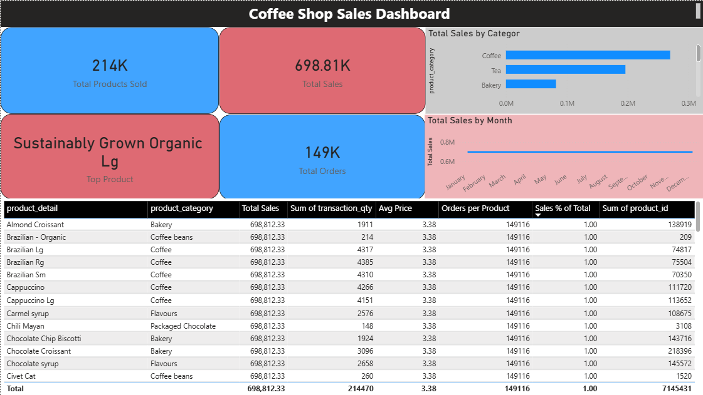

# 📊 Coffee Shop Sales Dashboard – Power BI (Week 4)

Welcome to Week 4 of my data visualization learning journey! This week, I built a **Coffee Shop Sales Dashboard** using Power BI to analyze sales performance across products, categories, and time.

The goal of this project was to practice working with transactional datasets, creating measures, and building an interactive dashboard using cards, charts, tables, and slicers.

---

## 🌟 Dashboard Preview



---

## 📁 Dataset Overview

The dataset used in this project is a **coffee shop transactions dataset**, where each row represents a product purchase.

**Key fields utilized:**
* **`transaction_id`** – Unique identifier for each order.
* **`transaction_date`** – Date of purchase.
* **`transaction_qty`** – Quantity of products sold.
* **`product_category`** – Category of product (Coffee, Tea, etc.).
* **`product_detail`** – Specific product name.
* **`unit_price`** – Price per unit.
* **`subtotal`** – Total price per transaction.

*Note: Before building the dashboard, I ensured that `transaction_date` was formatted as a Date type and `subtotal` was numeric.*

---

## 🛠️ Step-by-Step Tutorial: How I Built the Dashboard

All visuals were created directly in Power BI and arranged into a structured layout.

### 1️⃣ Dashboard Title
*Adding a professional header to the dashboard.*

**Steps:**
1. Insert a **Text Box** at the top of the canvas.
2. Enter the title: **Coffee Shop Sales Dashboard**.
3. Go to the *Effects* section:
   * Set **Background color** → Black
   * Change **Text color** → White
   * Change **Font** → Bold
4. Adjust size and alignment for a clean header.

### 2️⃣ Creating Measures
*Before building visuals, I created key DAX measures.*

**Total Sales**:
```dax
Total Sales = SUM('Transactions (2)'[subtotal])
```

**Total Products Sold**:
```dax
Total Products Sold = SUM('Transactions (2)'[transaction_qty])
```

**Total Orders**:
```dax
Total Orders = COUNT('Transactions (2)'[transaction_id])
```

**Sales % of Total**:
```dax
Sales % of Total = 
DIVIDE(
    SUM('Transactions (2)'[subtotal]),
    CALCULATE(
        SUM('Transactions (2)'[subtotal]),
        ALL('Transactions (2)')
    )
)
```

### 3️⃣ KPI Cards
*I created four cards to display key business metrics.*

**Steps:**
1. Insert a **Card** visual.
2. Add each measure to a separate card:
   * **Total Sales**
   * **Total Products Sold**
   * **Total Orders**
   * **Top Product** *(measure created using TOPN)*
3. Go to *Effects* → *Background*:
   * Apply alternating colors (**Red** & **Blue**) across the cards.
4. Adjust Font size, Alignment, and Titles for clarity.

### 4️⃣ Bar Chart – Sales by Category
*This visualization shows which product categories generate the most sales.*

**Steps:**
1. Insert a **Bar Chart** visual.
2. Add **`product_category`** to the *Y-axis* (or *Axis*).
3. Add **`Total Sales`** to the *X-axis* (or *Values*).
4. Sort the chart descending by **Total Sales**.
5. Enable **Data Labels**.
6. Set the **Background color** → Grey.
7. Rename the chart title to: **👉 Sales by Product Category**.

### 5️⃣ Line Chart – Monthly Sales Trend
*This visualization tracks the trend of total sales over time.*

**Steps:**
1. Insert a **Line Chart** visual.
2. Add **`transaction_date`** to the *X-axis*.
3. Add **`Total Sales`** to the *Y-axis*.
4. Ensure it is using the exact **Date** (not a date hierarchy).
5. Adjust axis settings (Type → Continuous, if needed).
6. Enable **Markers**.
7. Rename the chart title to: **👉 Monthly Sales Trend**.

### 6️⃣ Table – Product-Level Sales
*A detailed view of sales performance for individual products.*

**Steps:**
1. Insert a **Table** visual.
2. Add the following fields:
   * **`product_detail`**
   * **`product_category`**
   * **`Total Sales`**
   * **`transaction_qty`**
   * **`Sales % of Total`**
3. Sort by **Total Sales** (Descending).
4. Rename the columns for display: *Product, Category, Total Sales, Quantity, Sales % of Total*.
5. Format with clean layout and proper spacing.

### 7️⃣ Slicers – Interactive Filters
*Slicers were added to allow users to filter the dashboard interactively.*

**Category Slicer Steps:**
1. Insert a **Slicer** visual.
2. Add **`product_category`**.
3. Change style to **Dropdown**.
4. Rename title to: **👉 Filter by Category**.

**Date Slicer Steps:**
1. Insert another **Slicer** visual.
2. Add **`transaction_date`**.
3. Set type to **Between** (range slider).
4. Rename title to: **👉 Filter by Date**.

---

## 🧩 Dashboard Design & Layout

**Steps to organize:**
1. Place the title at the top.
2. Add the slicers directly below the title.
3. Arrange the **KPI cards** in a single row below the slicers.
4. Place the **Bar chart on the left** and **Line chart on the right**.
5. Place the **Table at the bottom** (full width).
6. Maintain consistent spacing and alignment across all elements.

**Color choices:**
* **Cards** → Alternating Red & Blue
* **Charts** → Grey background
* **Title** → Black with white text

---

## 🧠 Skills Practiced

Through this project, I practiced several key analytical and Power BI concepts:
* Creating **DAX measures** (`SUM`, `COUNT`, `DIVIDE`, `TOPN`).
* Building **KPI cards** for high-level business metrics.
* Designing effective **bar and line charts**.
* Creating interactive dashboards using **slicers**.
* Structuring detailed tables for granular analysis.
* Applying consistent formatting, color palettes, and layout design.
* Debugging issues related to aggregation and date grouping.

---

## 🌳 Repository Structure

```text
📦 Week4
┣ 📂 Dashboard
┃ ┣ 📜 Week4CoffeeShopDashboardPowerBI.png
┃ ┗ 📜 Week4CoffeeShopSalesDashboard.pbix
┣ 📂 Dataset
┗ 📜 README.md
```

---

## 🚀 Reflection

This project was a great opportunity to get hands-on experience with transactional data and DAX in Power BI. By building measures from scratch and combining them into an interactive layout, Gained a deeper understanding of how to connect raw data directly to business insights.
